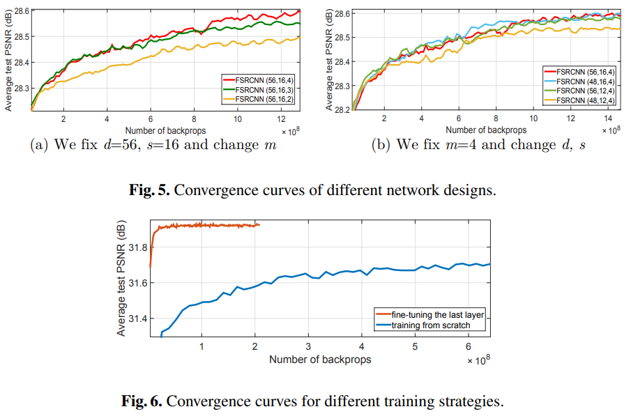

This paper proposes a Fast Super-Resolution Conovlutional Neural Network (FSRCNN), adopting a compact hourglass-shape CNN structure and deconvolution filters for faster speed.

# Summary

### Problem:

SRCNN is faster than previous learning-based methods, yet speed on large image is still unsatisfactory (not real-time)

Reducing parameters will affect accuracy

Two inherent limitations of SRCNN that restrict its running speed

- As a preprocessing step, original LR image need to be upsampled to the desired size using bicubic interpolation to form the input
    
    → computation complexity grows quadratically with spatial size of HR image
    
- Costly non-linear mapping step
    
    → Input image patches are projected on a high-dimensional LR feature space
    

### Paper's **Solution:**

A concise and efficient network structure for fast and accurate image SR (FSRCNN) is proposed to address the above problems through the following methods:

- Adopt a deconvolution layer to replace the bicubic interpolation, and place it at the end of hte network
    
    → computational complexity is only proportional to the spatial size of the original LR image
    
- Add a shrinking and an expanding layer at the beginning and the end of mapping layer to restrict mapping to a low-dimensional feature space. (Hourglass architecture)

Through such implementations, a notable imrovement in speed is made.

Apart from that, FSRCNN is also able to facilitate training and testing for different upscaling factors.

### Proposed Methods

**Model Architecture**

*Conv(Filter size, # of filter, # of channels)

FSRCNN model can be decomposed into 5 parts :

- Feature extraction
- Shrinking
- Mapping
- Expanding
- Deconvolution

**Feature Extraction**

- Unlike SRCNN, feature extraction is performed on the original LR image
- A 5x5 patch in LR input can cover almost all information of a 9x9 patch in SRCNN’s interpolated input.
- Hence adopt a smaller filter with no information loss

**Shrinking**

In SRCNN

- High-dimensional LR features are mapped directly to the HR feature space, but LR feature dimension d is usually very large, hence computational complexity is high

IN FSRCNN

- Adopt a shrinking layer to reduce LR feature dimension to s, while fixing filter size to be 1.
- Strategy greatly reduces number of parameters

**Mapping**

- Most influencing factors : width(# of filters in a layer) and depth(# of layers) of mapping layer
- Use of multiple medium size filter (3x3) to rpelace single wide one
- Number of a mapping layers (m) is another variable to consider

**Expanding**

- Inverse process of shrinking layer
- Mapping LR feature dimension to HR feature dimension before upscaling

**Deconvolution**

- Upsamples and aggregates previous features with a set of deconvolution filters
- Deconvolution’s stride k is set to the desired upscaling factor

**PReLU**

- Parametric Rectified Linear Unit (PReLU) is chosen as our activation function after each convolution layer
- Experiments show that use of PReLU over ReLU show more stable results

**Overall Structure :**

Conv(5,d,1) → PReLU → Conv(1,s,d) → PReLU → m x Conv(3,s,s) → PReLU → Conv(1,d,s) → PReLU → DeConv(9,1,d)

Cost Function : MSE with standard SGD and backprop

**Difference against SRCNN : From SRCNN to FSRCNN**

SRCNN-Ex : Large SRCNN

Transition State 1 : SRCNN-Ex with Deconv layer for upscaling

Transition State 2 : Previous state with mapping layer replaced with Shrinking + Mapping + Expanding

Transition State 3 : Previous state with tuned parameters, smaller filter size, yet better performance

**SR for Different Upscaling Factors**

- Only last deconv layer contains information of the upscaling factor (conv filters are the same for different upscaling factors)
- Hence can fine-tune deconv layer for other upscaling factors and leave conv layers unchanged
- Fine-tuning is fast, and performance is good as training from scratch

### Experiment and Evaluation

**Training Dataset**

Contribute a new General-100 dataset that contains 100 bmp-format images

Good quality with clear edges, fewer smooth region

Use of General-100 dataset and 91-image dataset for training

Adopt data augmentations (scalling, rotation)

**Test Dataset**

Set 5, Set14, BSD200 used for testing

20 images from BSD500 used for validation

**Investigation on Different Settings**

**Experiments for Different Upscaling Factors**

- FSRCNN enjoys flexibility of learning and testing across upscaling factors through transferring the convolution filters
- Network converges fast with same good performance as training from scratch

### Conclusion

Proposed a more efficient network structure to achieve high running speed without the loss of restoration quality

Achieves a final acceleration of more than 40 times

Satisfactory SR performance while superior in terms of run-time
