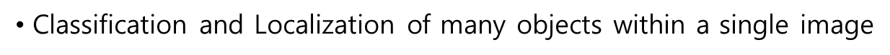
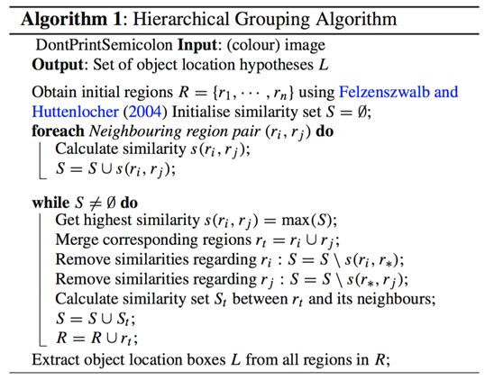

This paper proposes a simple and scalable object detection algorithm that combines region proposals with CNNs to achieve SoTA mAP results in object detection

# Summary

### Problem:

Object detection : localization of many objects within an image

1. **CNN Localization problem**
    
    Previous approach : Sliding-window detector
    
    → CNN’s have large receptive fields, making precise localization within the sliding-window paradigm an open challenge
    
    → Sliding-window computes for all possible windows, hence computationally heavy
    
2. **Labeled data is scare and is insufficient to train a large CNN**

### Paper's **Solution:**

1. **“Recognition using regions” approach**

Propose regions of interest using selective search algorithm, and classify each region through a feature-extracting CNN and category-specific SVM

We call this RCNN

1. **Supervised pre-training followed by domain specific fine-tuning**

Contributions

1. Apply high-capacity CNN to bottom-up region proposals in order to localize and segment objects
2. Supervised pre-training for an auxiliary task followed by domain-specific fine-tuning

### Proposed Methods

**Model Architecture**

Composed of three modules:

- Category-independent Region proposals
- Feature extracting CNN
- Class-specific linear SVM

Algorithm is as follows :

1. Apply the Selective Search algorithm to extract ~2000 class-independent RoI(Region of Interest) from the input image
2. Apply warping to all RoIs to match the CNN input size
3. Input all ~2000 RoI independently to feature extractor CNN to extract feature vectors for each RoI
4. Feature vectors are fed into class-specific SVM and bounding-box regressors to find class and bounding box pertaining to each RoI
5. Apply greedy Non-maximum supression for each class to eliminate duplicate bounding boxes.

**Selective Search**

Hierarchical grouping algorithm that segments objects in an image through multiple iterations based on the objects RGB, HSV, and etc. 

RCNN uses selective search to extract RoIs from an image

**Training Bounding Box Regressors**

Bounding box regressors are used to further correct initial RoI proposed by selective search algorithm. They need to be pretrained separately using a pair of prediction and GT coordinates.

Given bounding box prediction coordinates:

and ground truth coordinates

The correction term d(p) can be expressed thorugh the following formula : 

And our goal is to learn the correction term d(p) through the following loss function :

**Training RCNN through Domain Specific Fine-tuning** 

1. Take existing model and pre-train for classification task

*classification datasets were much more abundant and accessible back then

- Pre-train CNN network (VGG, ResNet) on image classification task (ILSVRC2012 classification dataset)
1. Take pretrained model and fine-tune for detection task
    - Replace ImageNet specific 1000-way classification layer with (N+1)-way classification layer
        
        *N classes with +1 for background class
        
    - Take pretrained CNN network and continue SGD training using only warped RoI as input

### Experiment and Evaluation

### Conclusion

Presented a simple and scalable object detection algorithm that gives 30% relatie improvement over the best previous result on PASCAL VOC 2012

Applied high-capacity  CNN to bottom-up region proposals in order to localize and segment objects

Show that it is highly effective to pretrain the network with supervision

### Limitations

- Selective search algorithm runs on the CPU and is slow to extract RoIs
- Need to extract feature vectors from ~2000 RoIs independently, hence feature vectors are propagated through a feature extractor CNN ~2000 times.
- Model is divided into three components (CNN, SVM, Regressor), hence need to be trained separately
- Need to cache feature vectors to disk, hence require memory
